# Sketch-DiT-ControlNet: Sketch-based Hair Patch Generation

**목표**: 컬러 스케치 + soft matte를 조건으로, 머리카락 영역(hair patch)을 현실적으로 생성한다.

기존 [SketchHairSalon](SketchHairSalon/README.md) 논문의 GAN 기반 S2I-Net을 **SD3.5 ControlNet (DiT)** 으로 교체하여, braid/unbraid 헤어스타일을 스케치에서 생성하는 모델을 학습·비교한다.

---

## 핵심 질문

> colored sketch + matte를 조건으로 줬을 때, DiT 기반 모델이 braid 구조(교차·땋임 패턴)를 실제로 따르는 hair region image를 생성할 수 있는가?

---

## 전체 파이프라인

```
[S2M 스케치 (grayscale)]
        │
        ▼
S2M-Net (SketchHairSalon, GAN) ──→ matte (soft alpha)
        │
        ├── [S2I 스케치 + matte] ──→ GAN (S2I-Net, ~100M)        ──→ hair patch (GAN)
        │
        └── [S2I 스케치 + matte] ──→ DiT ControlNet (우리 모델)   ──→ hair patch (DiT)
                                                                          │
                                                               composite.py
                                                               hair * matte + face * (1 - matte)
                                                               + Gaussian feathering
                                                                          │
                                                               inpaint_boundary.py
                                                               경계 ring (dilate-erode) inpainting
                                                               SD2 inpaint, strength=0.45
                                                                          │
                                                                최종 합성 이미지
```

---

## GAN vs DiT 비교

### 생성 모델

| 항목 | GAN (SketchHairSalon S2I-Net) | DiT (우리 모델) |
|---|---|---|
| 모델 | pix2pix 계열 (~100M) | SD3.5 Medium + HairControlNet (~3.7B trainable) |
| 학습 방식 | Adversarial (Generator + Discriminator) | Flow Matching (v-prediction, Rectified Flow) |
| 텍스트 조건 | 없음 | null text embedding (학습 가능 파라미터) |
| 해상도 | 512×512 | 512×512 (latent 64×64) |
| 모드 붕괴 | 있음 | 없음 |
| 텍스처 디테일 | 제한적 | strand 분리, 광택, 음영 향상 |

### 조건 주입 메커니즘

**GAN (feature-level blending)**
```
디코더 마지막 4개 레이어에서:
F_i = F_i^hair × M_i + F_i^BG × (1 - M_i)
```
- 별도의 Background Encoder가 face 이미지(hair 영역 → Gaussian noise 대체)를 처리
- matte가 feature blending 가중치로 직접 사용됨

**DiT (ControlNet residual injection)**
```
sketch → frozen VAE → sketch_latent (16ch, 64×64)
matte  → MatteCNN   → matte_feat   (16ch, 64×64)
ctrl_cond = sketch_latent + matte_feat
        ↓
HairControlNet (12 blocks) → residuals[0..11]
        ↓
SD3.5 Transformer (24 blocks, frozen):
  hidden_states += residuals[int(i / 2)]   ← 24블록 전체에 2블록 간격으로 주입
```

### matte 활용 방식

| 항목 | GAN | DiT |
|---|---|---|
| matte 역할 | feature blending 가중치 (네트워크 내부) | spatial conditioning signal (MatteCNN) |
| 배경 처리 | Gaussian noise로 대체한 BG 입력 필요 | 없음 (hair patch만 생성 후 후처리 합성) |
| 합성 위치 | 네트워크 내부 (feature level) | 외부 후처리 (image level + boundary inpainting) |

### 색 제어

| 항목 | GAN (`color_coding`) | DiT (`StrokeColorSampler`) |
|---|---|---|
| stroke 구분 방식 | grayscale 밝기값 | RGB 값 그대로 양자화 |
| collision 위험 | 있음 (밝기 유사 → stroke 합산) | 없음 (RGB로 정확히 구분) |
| 색 할당 | target 위치 픽셀 평균 | target 위치 픽셀 무작위 1개 샘플링 |
| 비자연 색상 지원 | 7만개 머리색 DB 매핑 | 학습 데이터 내 자연 머리색 범위로 제한 |

---

## 학습 전략: 2단계 커리큘럼

| Phase | 데이터 | Epochs | 목적 |
|---|---|---|---|
| Phase 1 | unbraid (~3,000샘플) | 40 | hair structure 기초 학습 |
| Phase 2 | braid (1,000샘플) | 100 | braid 특화 fine-tune (교차·땋임 패턴) |

기존 논문은 braid/unbraid를 분리하지 않고 단일 모델 학습. 커리큘럼 학습으로 Phase 2 최종 avg loss **0.0105** 달성.

---

## 아키텍처 구성

```
sketch (3ch, 512×512) ──→ frozen SD3.5 VAE ──→ sketch_latent (16ch, 64×64)
matte  (1ch, 512×512) ──→ MatteCNN         ──→ matte_feat   (16ch, 64×64)
                                                        │ ADD
                                             ctrl_cond (16ch, 64×64)
                                                        │
noise (16ch, 64×64) ──→ HairControlNet (12 blocks, trainable)
+ ctrl_cond                                             │ residuals[0..11]
                                                        ▼
noise (16ch, 64×64) ──→ SD3.5 Transformer (24 blocks, frozen)
                        + null text embedding
                        + ControlNet residuals injected
                                                        │
                                                   v_pred (16ch)
                                                        │
                                             Euler sampling (20 steps)
                                                        │
                                          SD3.5 VAE decode
                                                        │
                                   hair region image (3ch, 512×512)
```

### 학습 가능 파라미터

| 컴포넌트 | 파라미터 수 | 학습 여부 |
|---|---|---|
| SD3.5 Transformer | ~2.5B | Frozen |
| SD3.5 VAE | ~80M | Frozen |
| HairControlNet (12 blocks) | ~1.2B | **Trainable** |
| MatteCNN | ~100K | **Trainable** |
| null_encoder_hidden_states | 333×4096 | **Trainable** |
| null_pooled_projections | 2048 | **Trainable** |

---

## 결과 비교

> 상세 결과 이미지: [phase2.md](phase2.md)

| Sketch | GAN | DiT (Ours) |
|:---:|:---:|:---:|
|  | 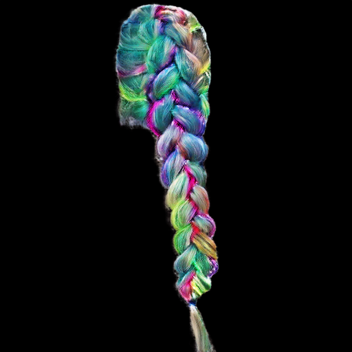 | 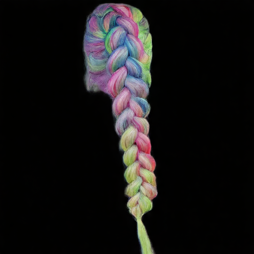 |
|  |  | 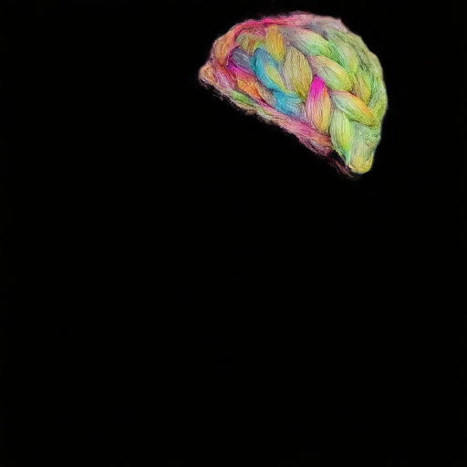 |
|  |  | 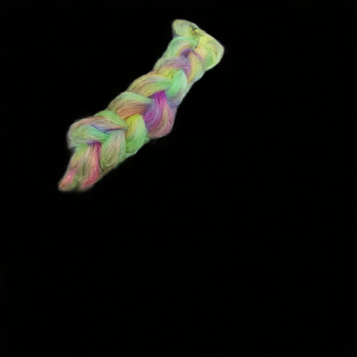 |

DiT로도 stroke 색에 의한 머리색 제어가 가능함을 확인하였다.

---

### 직접 그린 스케치 — Custom Sketch 결과

| Sketch | Matte | GAN | DiT(Ours) |
|:---:|:---:|:---:|:---:|
| 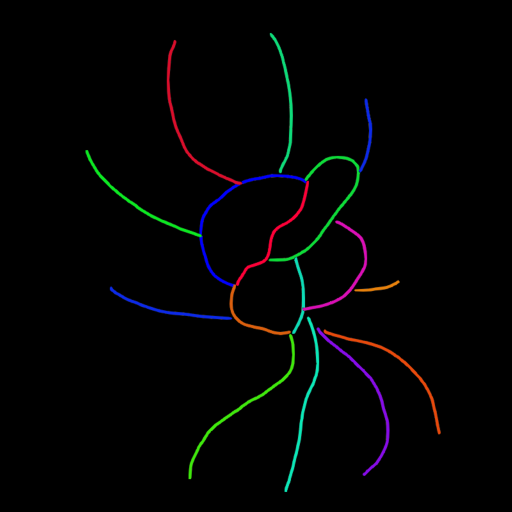 | 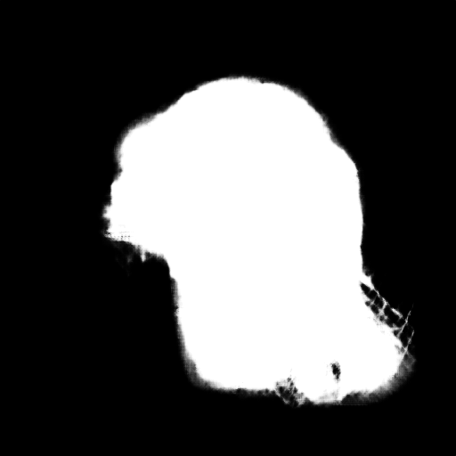 | 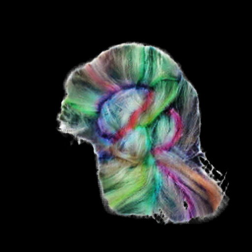 | 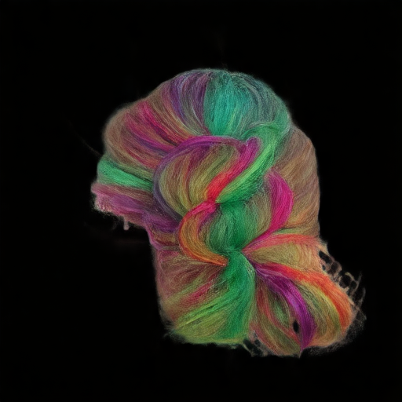 |

---

## 최종 합성 결과 (DiT → composite → boundary inpainting)

hair patch 생성 후 face 이미지에 alpha 합성 + SD2 경계 inpainting까지 적용한 최종 출력.

| | | | |
|:---:|:---:|:---:|:---:|
| 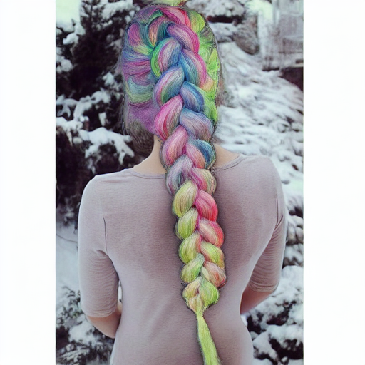 | 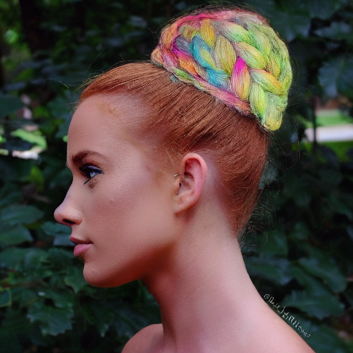 | 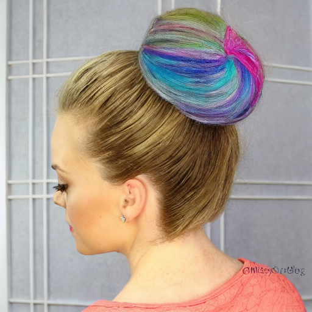 | 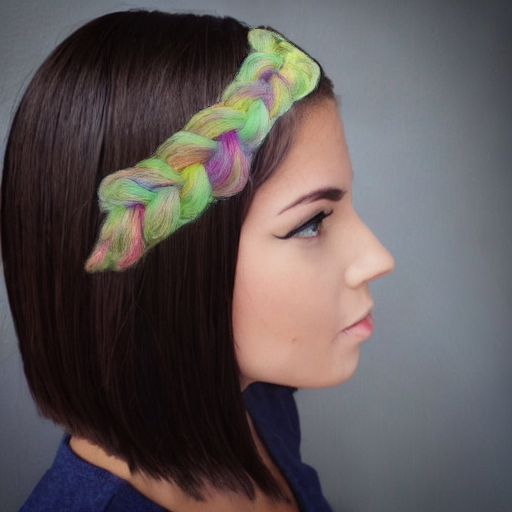 |
| 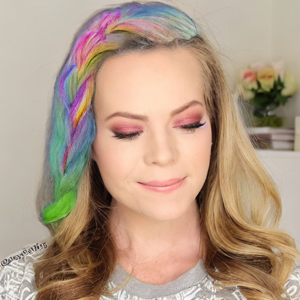 | 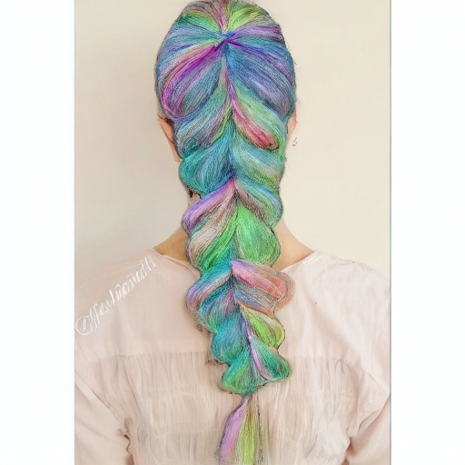 | 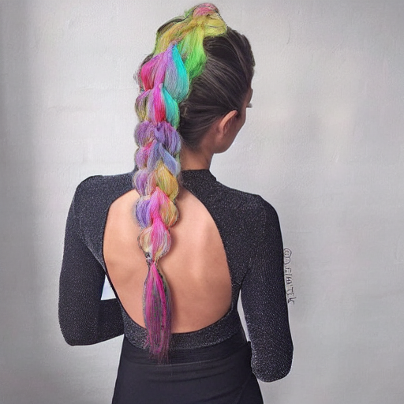 | 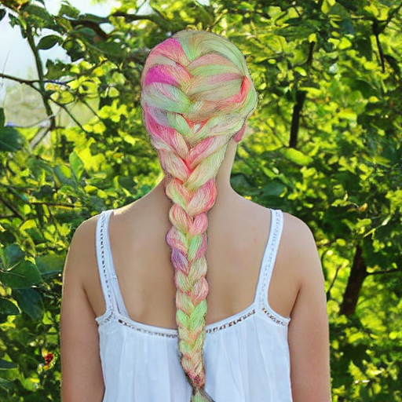 |
| 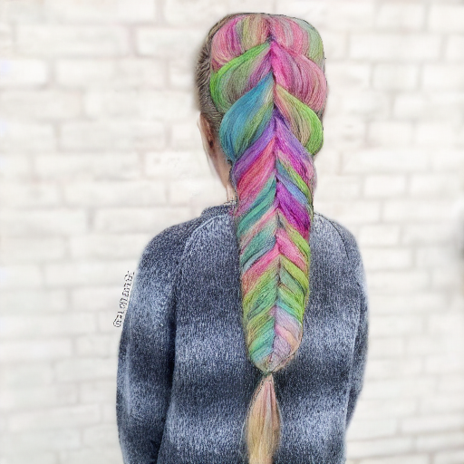 | 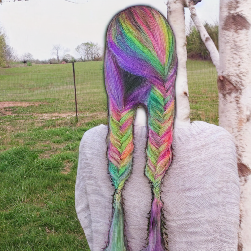 | 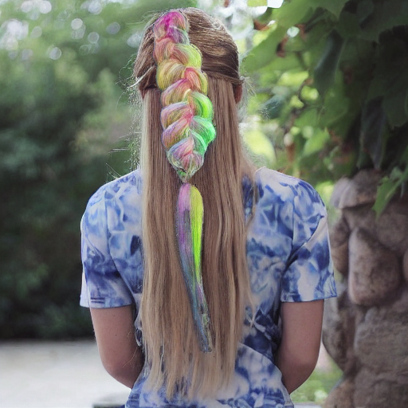 | 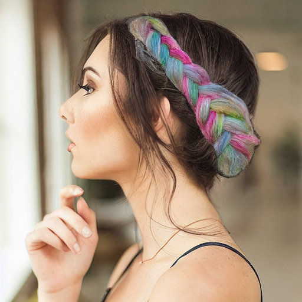 |
| 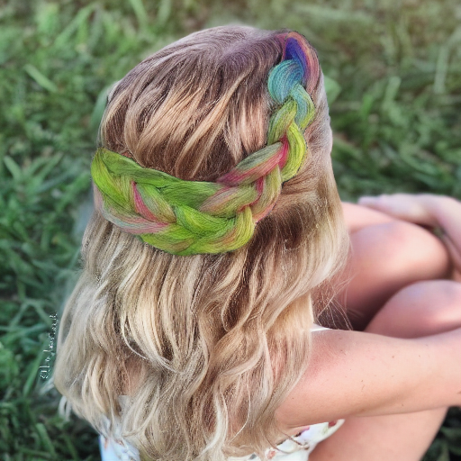 | 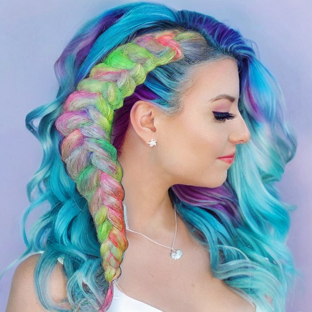 | 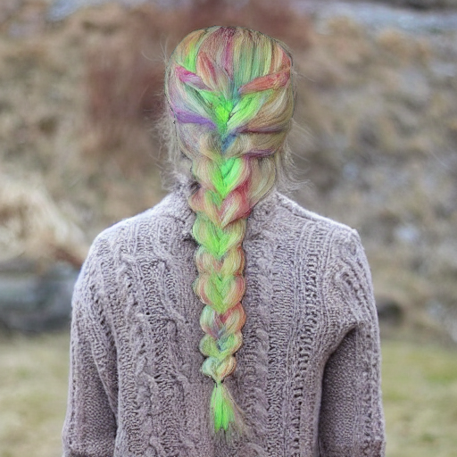 | 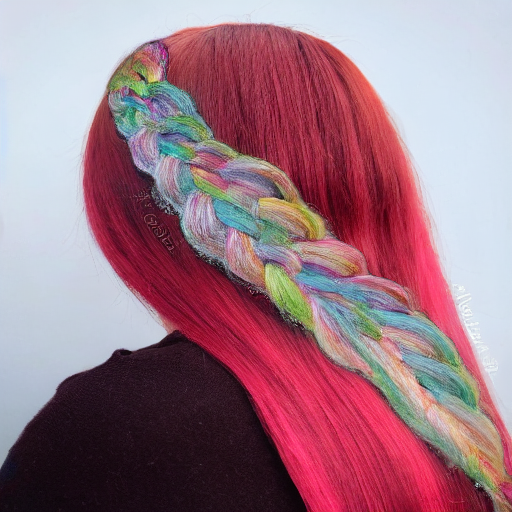 |

---

## Novelty 정리

| # | 기여 | 설명 |
|---|---|---|
| N1 | GAN → DiT 교체 | SD3.5 사전학습 feature를 ControlNet으로 재활용, 모드 붕괴 없음 |
| N2 | MatteCNN | soft matte를 16ch latent 공간 신호로 변환, spatial conditioning |
| N3 | StrokeColorSampler | RGB 양자화로 collision-free 색 제어 (GAN grayscale 방식 개선) |
| N4 | 2단계 커리큘럼 학습 | unbraid pretrain → braid fine-tune, 빠른 수렴 |
| N5 | dilate-erode ring inpainting | hair-face 경계를 SD2로 후처리, 자연스러운 합성 |

---

## 파일 구조

```
src/
  models/
    vae_wrapper.py        # SD3.5 VAE (16ch, frozen)
    controlnet_sd35.py    # HairControlNet + MatteCNN
  data/
    dataset.py            # HairRegionDataset (sketch, matte, target triplets)
    augmentation.py       # 4종 augmentation pipeline
    utils.py              # soft_composite, resize_matte_to_latent
  training/
    trainer.py            # Unified trainer (Phase 1 & 2)
    losses.py             # FlowMatchingLoss + PerceptualLoss + SketchEdgeAlignmentLoss
    ema.py                # EMA for HairControlNet

configs/
  base.yaml               # 공통 설정 (model_id, mixed_precision 등)
  phase1_unbraid.yaml     # Phase 1 config
  phase2_braid.yaml       # Phase 2 config

scripts/
  train.py                # python scripts/train.py --config configs/phase1_unbraid.yaml
  infer_custom.py         # DiT single sample inference
  composite.py            # hair region → face image 합성
  inpaint_boundary.py     # 경계 ring inpainting (SD2)
  batch_composite.py      # 배치 합성
  batch_inpaint.py        # 배치 inpainting
  show_results.py         # 결과 시각화
```

---

## 사용법

> 상세 가이드: [howtouseit.md](howtouseit.md)

### 빠른 시작

```bash
# Step 1: matte 생성 (SketchHairSalon S2M-Net)
cd ~/hair-dit/SketchHairSalon
python3 S2M_test.py braid

# Step 2: DiT로 hair patch 생성
cd ~/hair-dit
python scripts/infer_custom.py \
  --sketch     <S2I_스케치_경로> \
  --matte      SketchHairSalon/results/generated_matte/<파일명>.png \
  --checkpoint checkpoints/dit/phase2_braid/final.pth \
  --config     configs/phase2_braid.yaml \
  --output_dir custom_results/dit/

# Step 3: face 이미지에 합성
python scripts/composite.py \
  --hair   custom_results/dit/<stem>_gen.png \
  --face   <face_이미지_경로> \
  --matte  SketchHairSalon/results/generated_matte/<파일명>.png \
  --output results/composite/<stem>_composited.png

# Step 4: 경계 inpainting
python scripts/inpaint_boundary.py \
  --composited results/composite/<stem>_composited.png \
  --matte      SketchHairSalon/results/generated_matte/<파일명>.png \
  --output     results/final/<stem>_final.png
```

---

## 문서 링크

| 문서 | 내용 |
|---|---|
| [architecture.md](architecture.md) | 전체 아키텍처 상세 설명 (모델 구조, 학습 방식, Novelty 정리) |
| [phase2.md](phase2.md) | Phase 2 braid fine-tuning 결과 및 GAN 비교 이미지 |
| [phase3.md](phase3.md) | Phase 3 compositing & 평가 계획 |
| [gan.md](gan.md) | GAN S2I-Net 작동 원리 (feature-level blending 상세) |
| [color.md](color.md) | stroke 색상 제어 방식 (GAN color_coding vs DiT StrokeColorSampler) |
| [howtouseit.md](howtouseit.md) | hair patch 생성 전체 파이프라인 가이드 |
| [new.md](new.md) | 다음 프로젝트 브리핑 (hair-inpaint: Dual ControlNet full image inpainting) |
| [logs/phase1_unbraid_loss.md](logs/phase1_unbraid_loss.md) | Phase 1 학습 loss 로그 |
| [logs/phase2_braid_loss.md](logs/phase2_braid_loss.md) | Phase 2 학습 loss 로그 |

---

## 평가 계획

| 지표 | 비교 대상 | 비고 |
|---|---|---|
| FID | GAN vs DiT (braid_test) | feature distribution 차이 |
| LPIPS | GAN vs DiT vs GT | perceptual similarity |
| 색 제어 정확도 | stroke 색 vs 생성 색 평균 ΔE | 색 대응 정량 평가 |
| 구조 일치도 | sketch edge vs gen edge (Canny) | edge alignment |
| 합성 자연스러움 | composite → inpaint 결과 주관 평가 | 경계 품질 |

---

## 다음 방향

[new.md](new.md) 참고 — composite.py를 완전 제거하고 **Dual ControlNet 기반 full image inpainting**으로 전환하는 `hair-inpaint` 프로젝트 설계 완료.
- FaceControlNet(masked face) + HairControlNet(sketch+matte) 동시 학습
- 논문 수식 `F_i = F_i^hair × M_i + F_i^BG × (1-M_i)` 를 DiT residual injection으로 구현
- face 영역 픽셀 수준 보존, hair 영역만 스케치대로 생성
