# Sketch-DiT-ControlNet: Sketch-Guided Hair Patch Synthesis via Diffusion Transformer

**Objective**: Given a color sketch and a soft alpha matte as conditioning signals, generate a photorealistic hair patch confined to the hair region. We replace the GAN-based S2I-Net from [SketchHairSalon](SketchHairSalon/README.md) with an SD3.5 ControlNet (DiT) to synthesize both braid and unbraid hairstyles from sketch input, and conduct systematic comparisons between the two paradigms.

---

## Research Question

> Can a DiT-based model, conditioned on a colored sketch and soft matte, generate hair region images that faithfully follow complex braid structures (crossing and interlacing patterns)?

---

## Overall Pipeline

```
[S2M Sketch (grayscale)]
        │
        ▼
S2M-Net (SketchHairSalon, GAN) ──→ matte (soft alpha)
        │
        ├── [S2I Sketch + matte] ──→ GAN (S2I-Net, ~100M)   ──→ hair patch (GAN)
        │
        └── [S2I Sketch + matte] ──→ DiT ControlNet (Ours)  ──→ hair patch (DiT)
```

---

## Architecture

```
sketch (3ch, 512×512) ──→ frozen SD3.5 VAE ──→ sketch_latent (16ch, 64×64)
matte  (1ch, 512×512) ──→ MatteCNN         ──→ matte_feat   (16ch, 64×64)
                                                        │ ADD → ctrl_cond_16 (16ch)
                                           + concat matte_64 (1ch, interpolated)
                                                        │
                                             ctrl_cond  (17ch, 64×64)
                                                        │
noise (16ch, 64×64) ──→ HairControlNet (12 blocks, trainable)
+ ctrl_cond                                             │ block_samples (residuals × 12)
                                                        ▼
noise (16ch, 64×64) ──→ SD3.5 Transformer (24 blocks, frozen)
                        + null text embedding (learned)
                        + ControlNet residuals injected (stride-2)
                                                        │
                                                   v_pred (16ch, velocity)
                                                        │
                                             Euler sampling (20 steps)
                                                        │
                                          SD3.5 VAE decode
                                                        │
                                   hair patch (3ch, 512×512)
```

### Control Conditioning (`ctrl_cond`) Construction

The HairControlNet receives a 17-channel conditioning tensor combining sketch and matte information in the latent space:

1. **MatteCNN** encodes the soft matte via three stride-2 convolutions (512→256→128→64) with GroupNorm and SiLU, producing `matte_feat` (16ch, 64×64).
2. **Sketch Encoding** uses the frozen SD3.5 VAE encoder to map the color sketch to `sketch_latent` (16ch, 64×64) — ensuring the conditioning resides in the same representation space as the denoising backbone.
3. The two features are fused via element-wise addition (`ctrl_cond_16 = sketch_latent + matte_feat`), and a raw bilinearly downsampled matte (`matte_64`, 1ch) is appended as an explicit spatial boundary channel:
   ```
   ctrl_cond = cat([ctrl_cond_16, matte_64], dim=1)   # (B, 17, 64, 64)
   ```

### Trainable Parameters

| Component | Parameters | Status |
|---|---|---|
| SD3.5 Transformer | ~2.5B | Frozen |
| SD3.5 VAE | ~80M | Frozen |
| HairControlNet (12 blocks) | ~1.2B | **Trainable** |
| MatteCNN | ~100K | **Trainable** |
| `null_encoder_hidden_states` | 333 × 4096 | **Trainable** |
| `null_pooled_projections` | 2048 | **Trainable** |

---

## GAN vs DiT Comparison

### Generative Model

| Item | GAN (SketchHairSalon S2I-Net) | DiT (Ours) |
|---|---|---|
| Architecture | pix2pix-based (~100M) | SD3.5 Medium + HairControlNet (~3.7B trainable) |
| Training Paradigm | Adversarial (Generator + Discriminator) | Flow Matching (v-prediction, Rectified Flow) |
| Text Conditioning | None | Learned null text embedding |
| Resolution | 512×512 | 512×512 (latent 64×64) |
| Mode Collapse | Present | Absent |
| Texture Detail | Limited | Enhanced strand separation, specularity, shading |

### Conditioning Mechanism

**GAN (feature-level blending)**
```
F_i = F_i^hair × M_i + F_i^BG × (1 − M_i)
```
- A separate Background Encoder processes the face image (hair region replaced with Gaussian noise).
- Matte acts as a feature-level blending weight directly within the network.

**DiT (ControlNet residual injection)**
```
sketch → frozen VAE → sketch_latent (16ch, 64×64)
matte  → MatteCNN   → matte_feat   (16ch, 64×64)
ctrl_cond = [sketch_latent + matte_feat ∥ matte_64]   # 17ch
        ↓
HairControlNet (12 blocks) → block_samples[0..11]
        ↓
SD3.5 Transformer (24 blocks, frozen):
  hidden_states += block_samples[i // 2]   ← injected at stride-2 intervals
```

### Matte Utilization

| Item | GAN | DiT |
|---|---|---|
| Matte Role | Feature blending weight (intra-network) | Spatial conditioning signal (MatteCNN + explicit channel) |
| Background Handling | Gaussian noise replacement of BG input required | None (hair patch only, compositing in post-process) |
| Compositing Location | Network-internal (feature level) | External post-processing (image level, v4 soft blend) |

### Color Control

| Item | GAN (`color_coding`) | DiT (`StrokeColorSampler`) |
|---|---|---|
| Stroke Identification | Grayscale luminance | RGB values (direct quantization) |
| Collision Risk | Present (similar luminance → stroke merging) | None (RGB-level exact discrimination) |
| Color Assignment | Average of target-region pixels | Random single-pixel sampling from target region |
| Non-natural Color Support | ~70K hair color DB mapping | Constrained to natural hair colors in training data |

---

## Training Strategy: Two-Phase Curriculum

| Phase | Data | Epochs | Loss | Objective |
|---|---|---|---|---|
| Phase 1 (Pretrain) | unbraid (~3,000 samples) | 50 | L_flow + L_lpips (after 30% warmup) | Acquire general hair synthesis capability |
| Phase 2 (Finetune) | braid (~1,000 samples) | 50 | L_flow + L_lpips + L_edge | Braid-specific fine-tuning (crossing/interlacing patterns) |

The baseline SketchHairSalon trains a single model on braid and unbraid without separation. Our curriculum learning achieves Phase 2 final avg loss of **0.0105**.

### Loss Functions

```
L = 1.0 × L_flow  +  0.1 × L_lpips  +  0.05 × L_edge   (Phase 2)
L = 1.0 × L_flow  +  0.1 × L_lpips                      (Phase 1, after warmup)
```

- **L_flow** (matte-weighted flow matching MSE): `w = matte_latent + 0.1 × (1 − matte_latent)` — hair region weighted 1.0, background 0.1.
- **L_lpips** (Perceptual Loss): LPIPS computed within the matte region on the predicted x₀ decoded to pixel space.
- **L_edge** (Sketch Edge Alignment, Phase 2 only): Sobel edge magnitude at sketch stroke positions penalizes structural deviation from input strokes.

---

## Compositing Strategy: v1–v4 Ablation

Hair patch compositing with the original face image was systematically evaluated across four variants. All DiT versions use the same trained checkpoint; only the compositing procedure differs.

| Version | Latent Compositing | Pixel Post-processing |
|---|---|---|
| **v1** | Hard mask: `hair_latent × (m > 0.5) + face_latent × (m ≤ 0.5)` | Hard mask: replace with face pixels |
| **v2** | Soft blend: `hair_latent × m + face_latent × (1−m)` | None |
| **v3** | Soft blend (same as v2) | Hard mask: replace with face pixels |
| **v4** (Adopted) | Soft blend (same as v2) | Soft blend: `decoded × m + face × (1−m)` |

### v4 Two-Stage Soft Blending

```python
# Stage 1: Latent soft blend (area pooling for matte downsample)
composite_latent = hair_latent * matte_64 + face_latent * (1.0 - matte_64)

# Stage 2: VAE decode
decoded = (vae.decode(composite_latent).clamp(-1,1) + 1) / 2

# Stage 3: Pixel soft blend (reconstruction artifact correction)
final = decoded * matte_512 + face * (1.0 - matte_512)
```

Area pooling for matte downsampling preserves soft transition values at hair boundaries, yielding natural blending at latent resolution. Stage 3 further corrects VAE decode artifacts by re-compositing in pixel space, eliminating sharp seams without discarding face-region fidelity.

---

## Quantitative Evaluation

### Braid Evaluation (n = 107 test samples)

| Metric | GAN (SHS) | DiT v1 | DiT v2 | DiT v3 | **DiT v4 (Ours)** |
|---|:---:|:---:|:---:|:---:|:---:|
| **Edge IoU ↑** | 0.1031 | 0.1047 | 0.1052 | **0.1062** | 0.1052 |
| **Chamfer Dist ↓** | 2.6926 | 2.6739 | 2.6636 | **2.6412** | 2.6474 |
| **Sketch LPIPS ↓** | **0.7589** | 0.7775 | 0.7734 | 0.7728 | 0.7697 |
| **Hair FID ↓** | 195.16 | 177.72 | 174.09 | 171.23 | **170.82** |
| **LPIPS (GT) ↓** | 0.3263 | 0.3250 | 0.3254 | 0.3227 | **0.3209** |
| **SSIM (GT) ↑** | 0.5906 | 0.5936 | 0.6012 | 0.6011 | **0.6073** |
| **PSNR (GT) ↑** | 11.18 | 12.16 | 12.40 | 12.41 | **12.41** |
| **Boundary FID ↓** | 50.97 | 37.17 | 40.89 | 39.07 | **21.97** |
| **Boundary LPIPS ↓** | 0.0272 | 0.0267 | 0.0361 | 0.0355 | **0.0152** |
| **Face LPIPS ↓** | 0.0036 | **0.0000** | 0.0302 | 0.0301 | 0.0015 |
| **ArcFace Cos ↑** | 0.7696 | 0.7916 | 0.7781 | 0.7797 | **0.7981** |

> FID: 107 samples (below recommended 500 — use as directional reference). ArcFace Cos: ResNet50 (ImageNet proxy embedding).

**Key v2 → v4 improvements:**
- Face LPIPS: `0.0302 → 0.0015` (**−95%**; v2 was 8.4× worse than SHS)
- Boundary LPIPS: `0.0361 → 0.0152` (**−58%**)
- Boundary FID: `40.89 → 21.97` (**−46%**)

**v4 summary**: Achieves best performance on Hair FID, LPIPS(GT), SSIM, PSNR, Boundary FID, Boundary LPIPS, and ArcFace Cos simultaneously. Marginal deficit on Edge IoU and Chamfer Distance versus v3 reflects the trade-off of soft boundary blending over hard pixel replacement.

---

### Comprehensive Evaluation: Braid + Unbraid (n = 573)

A single DiT checkpoint (braid Phase 2) is applied to unbraid samples without any fine-tuning, assessing zero-shot cross-domain generalization. SHS uses separate checkpoints for each domain.

#### Unbraid — Zero-Shot Cross-Domain (n = 466)

> Ours **9/11** metrics win | SHS **2/11** (Edge IoU, Chamfer Dist)

| Metric | SHS (GAN) | Ours (DiT) | Δ (%) |
|---|:---:|:---:|:---:|
| Edge IoU ↑ | **0.0560** | 0.0551 | −1.6% |
| Chamfer Dist ↓ | **5.1323** | 5.2480 | +2.3% |
| Sketch LPIPS ↓ | 0.7623 | **0.7305** | **−4.2%** |
| Hair FID ↓ | 170.77 | **131.62** | **−22.9%** |
| LPIPS (GT) ↓ | 0.3136 | **0.2851** | **−9.1%** |
| SSIM (GT) ↑ | 0.5814 | **0.5967** | +2.6% |
| PSNR (GT) ↑ | 10.82 | **12.02** | **+1.20 dB** |
| Boundary FID ↓ | 23.79 | **12.27** | **−48.4%** |
| Boundary LPIPS ↓ | 0.0246 | **0.0185** | −24.8% |
| Face LPIPS ↓ | 0.0043 | **0.0034** | −20.9% |
| ArcFace Cos ↑ | 0.6410 | **0.6700** | +4.5% |

#### Combined (Braid v4 + Unbraid, n = 573)

> Ours **9/11** metrics win | SHS **2/11** (Edge IoU ≈ tie, Chamfer Dist)

| Metric | SHS (GAN) | Ours (DiT) | Δ (%) |
|---|:---:|:---:|:---:|
| Edge IoU ↑ | **0.0648** | 0.0645 | ≈ tie |
| Chamfer Dist ↓ | **4.6767** | 4.7624 | +1.8% |
| Sketch LPIPS ↓ | 0.7616 | **0.7378** | **−3.1%** |
| Hair FID ↓ | 163.78 | **127.92** | **−21.9%** |
| LPIPS (GT) ↓ | 0.3159 | **0.2918** | **−7.6%** |
| SSIM (GT) ↑ | 0.5831 | **0.5987** | +2.7% |
| PSNR (GT) ↑ | 10.89 | **12.09** | **+1.20 dB** |
| Boundary FID ↓ | 24.70 | **11.87** | **−51.9%** |
| Boundary LPIPS ↓ | 0.0251 | **0.0179** | −28.7% |
| Face LPIPS ↓ | 0.0042 | **0.0031** | −26.2% |
| ArcFace Cos ↑ | 0.6650 | **0.6939** | +4.3% |

**Findings**: The zero-shot cross-domain result demonstrates that the braid-trained DiT model generalizes strongly to unbraid — superior on 9/11 metrics without any domain-specific fine-tuning. SHS's advantage on sketch-fidelity metrics (Edge IoU, Chamfer Distance) in the unbraid domain does not translate to perceptual or distributional quality, where our model is consistently superior. PSNR improvement of +1.20 dB is systematic and stable across both domains.

---

## Qualitative Results

> Detailed per-image results: [0430](./[0430][서현택].md) | Comprehensive evaluation: [0501CE](./[0501][서현택]CE.md)

| Sketch | GAN | DiT (Ours) |
|:---:|:---:|:---:|
|  | 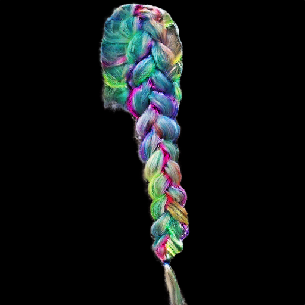 | 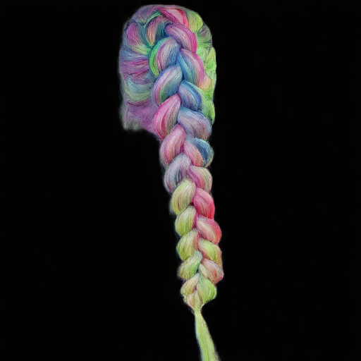 |
|  | 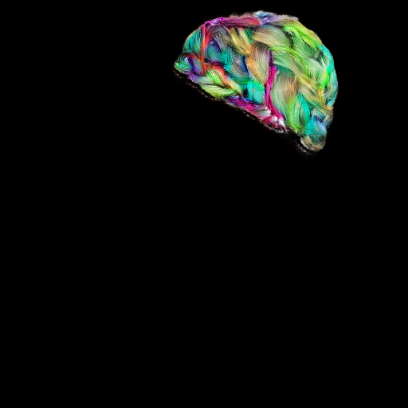 | 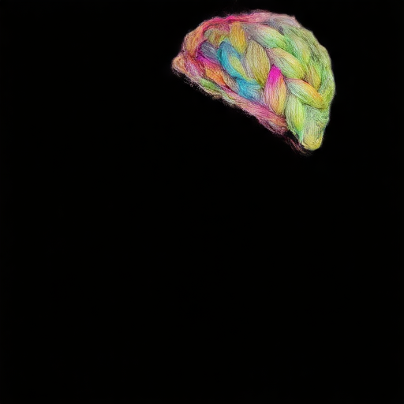 |
| 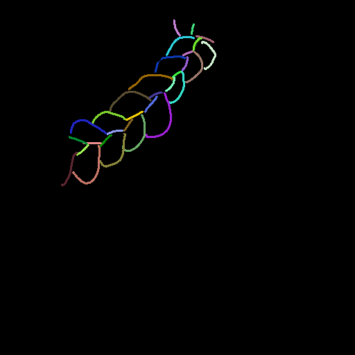 | 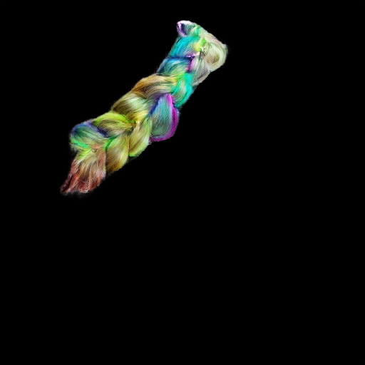 | 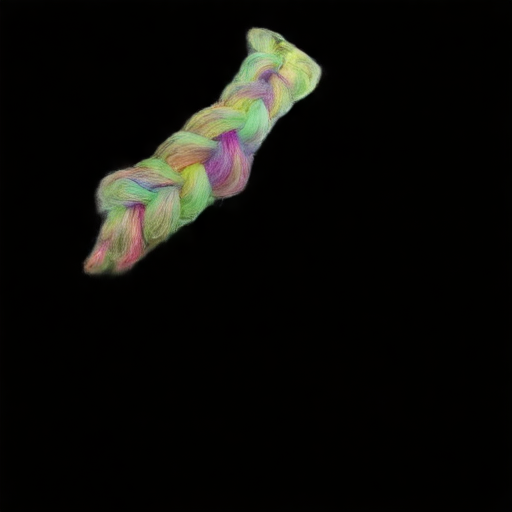 |

Color controllability via stroke color is confirmed: the DiT model generates hair color consistent with the input stroke RGB values.

---

### Custom Sketch (Out-of-distribution Generalization)

| Sketch | Matte | GAN | DiT (Ours) |
|:---:|:---:|:---:|:---:|
| 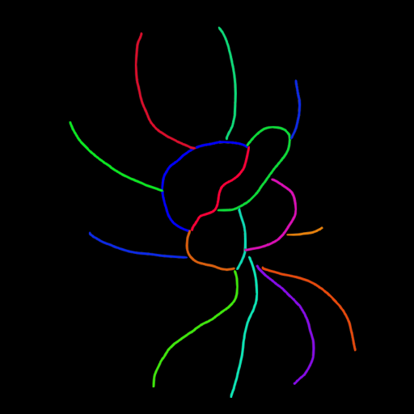 | 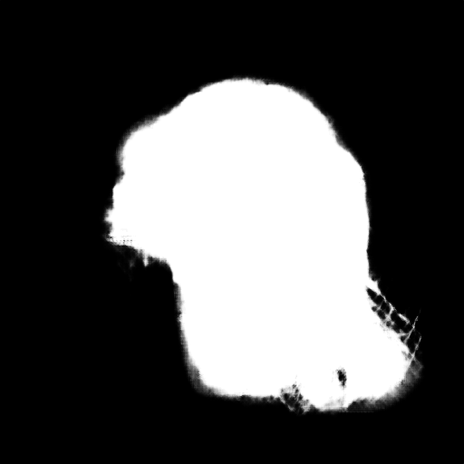 | 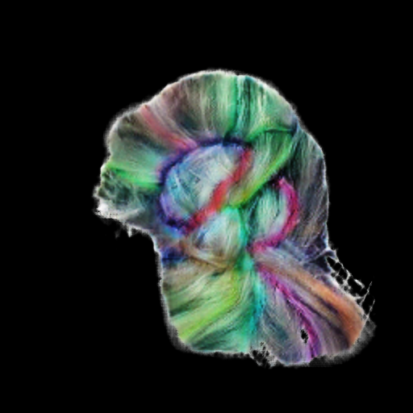 | 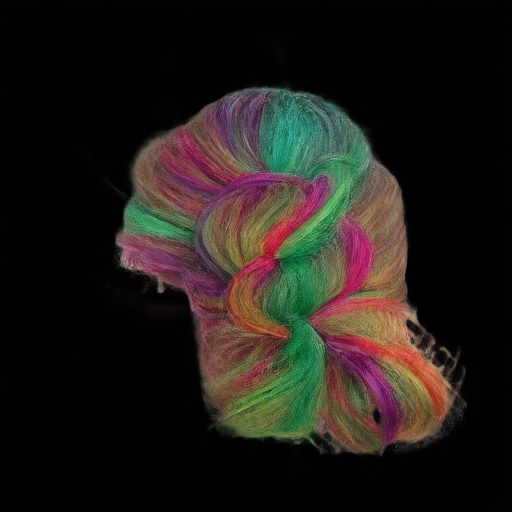 |

---

## Final Composite Results (DiT → latent blend → pixel blend)

Hair patches composited onto face images via v4 two-stage soft blending.

| | | | |
|:---:|:---:|:---:|:---:|
| 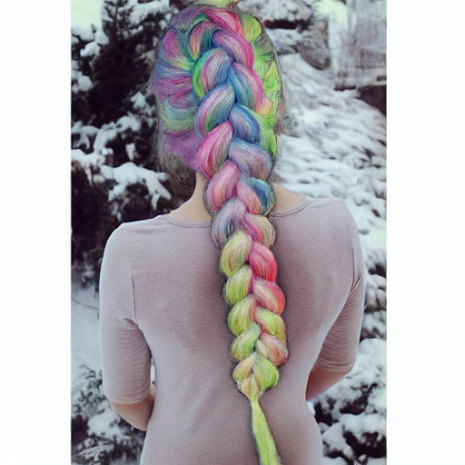 | 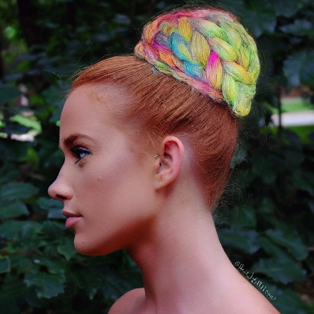 | 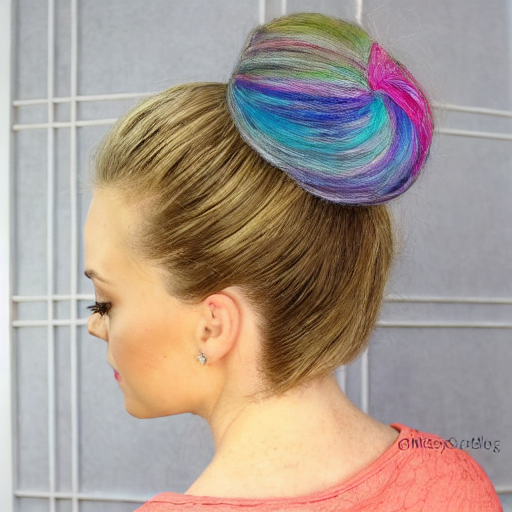 | 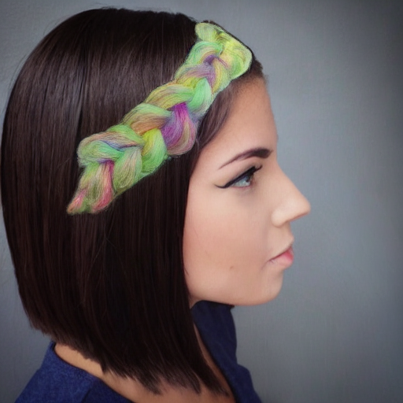 |
| 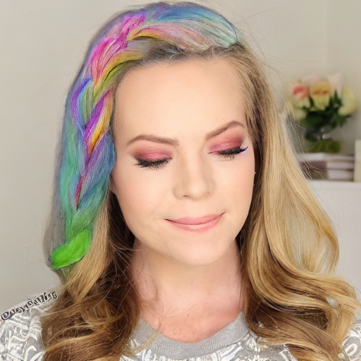 | 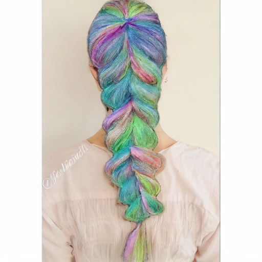 | 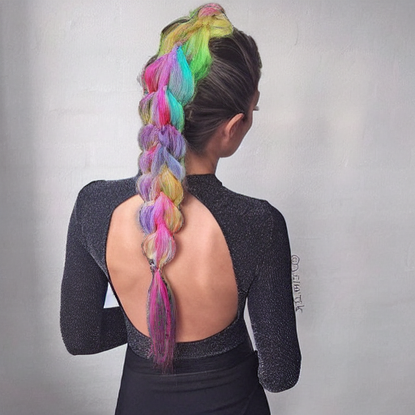 | 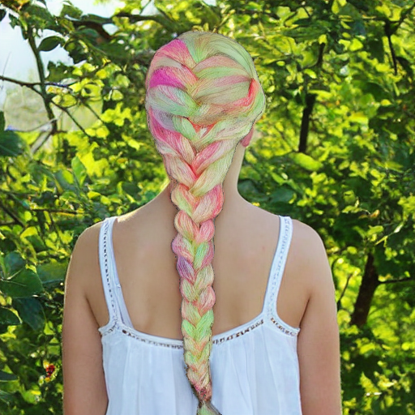 |
| 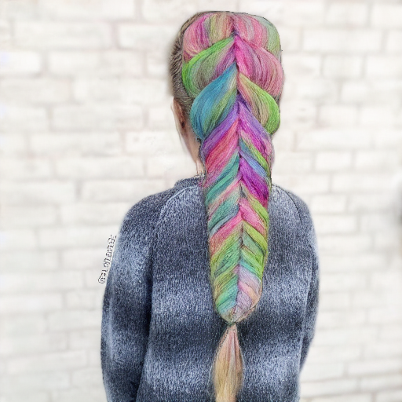 | 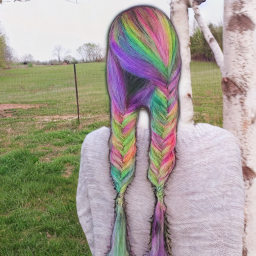 | 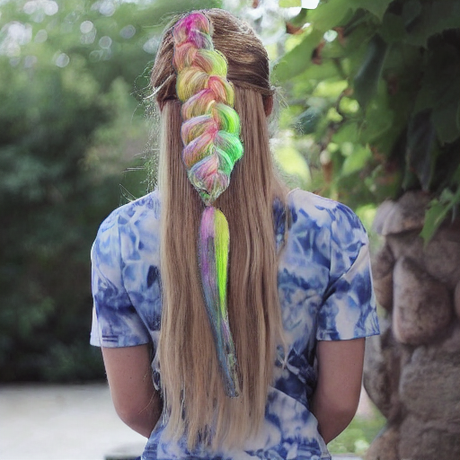 | 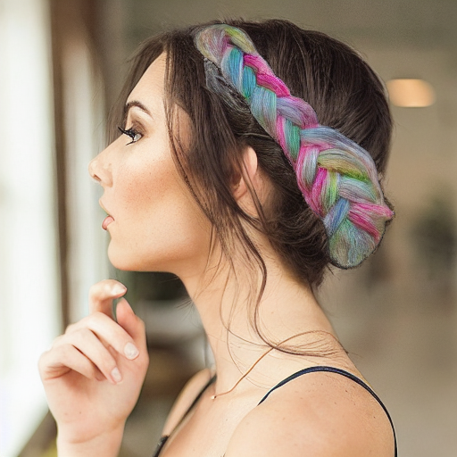 |
| 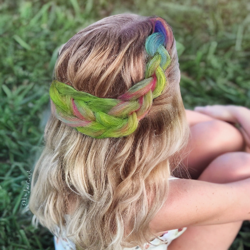 | 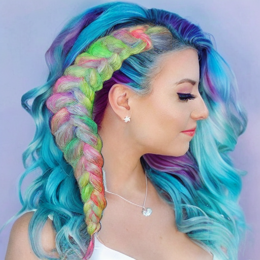 | 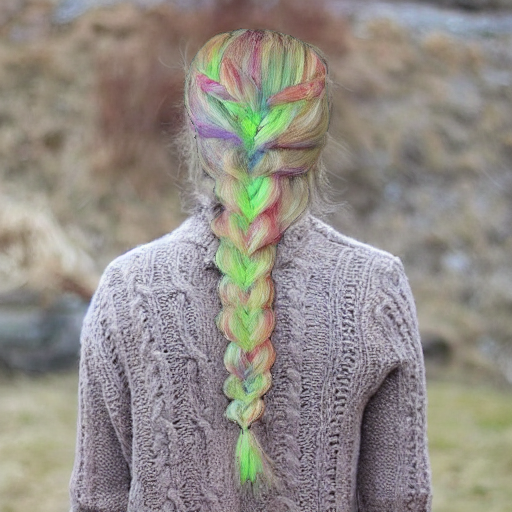 | 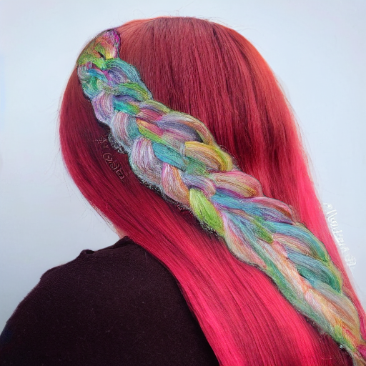 |

---

## Limitations

### 1. Complex Multi-layer Hairstyles
Dense wisp-strand layering is fundamentally underdetermined from a 2D sketch alone: depth relationships between strands are lost in projection, making it impossible to recover a consistent layered structure from sketch input without additional depth or ordering information.

### 2. Atypical Hair Structures (Dreadlocks / Spirals / Coils)
Self-occluded wisp or coil structures represented as single strokes cause the model to regress toward the training distribution (wavy hair). Two compounding factors: (1) such structures are difficult to express unambiguously as colored strokes, and (2) dataset coverage of these styles is sparse.

### 3. Lighting Inconsistency
Lighting condition mismatch between the generated hair region and the background face produces boundary artifacts. Hair foreground relighting remains an open problem and is not addressed in the current pipeline.

| | **Image** | **Sketch** | **Matte** |
|:--:|:---------:|:----------:|:---------:|
| **limit 1** |  |  |  |
| **limit 2** |  |  |  |

| | **GT** | **Sketch** | **SHS** | **Ours** |
|:--:|:------:|:---------:|:-------:|:--------:|
| **limit 1** |  |  |  |  |
| **limit 2** |  |  |  |  |

---

## Contributions Summary

| # | Contribution | Description |
|---|---|---|
| C1 | GAN → DiT replacement | Leverages SD3.5 pre-trained representations via ControlNet; eliminates mode collapse |
| C2 | MatteCNN | Encodes soft matte into 16ch latent-space signal for spatial conditioning |
| C3 | 17ch ctrl_cond | Combines sketch latent + matte feature (addition) with explicit matte boundary channel (concatenation) |
| C4 | StrokeColorSampler | RGB-level quantization for collision-free color control (vs. GAN's grayscale luminance mapping) |
| C5 | Two-phase curriculum | unbraid pretrain → braid fine-tune with L_edge; accelerates convergence on complex interlacing patterns |
| C6 | v4 two-stage soft compositing | Latent soft blend + pixel soft blend; Boundary FID −56.9% vs SHS on braid domain |
| C7 | Zero-shot cross-domain | Single braid checkpoint achieves 9/11 metric wins on unbraid domain against SHS's domain-specific model |

---

## File Structure

```
src/
  models/
    vae_wrapper.py        # SD3.5 VAE (16ch, frozen)
    controlnet_sd35.py    # HairControlNet + MatteCNN
  data/
    dataset.py            # HairRegionDataset (sketch, matte, target triplets)
    augmentation.py       # 4-type augmentation pipeline
    utils.py              # soft_composite, resize_matte_to_latent
  training/
    trainer.py            # Unified trainer (Phase 1 & 2)
    losses.py             # FlowMatchingLoss + PerceptualLoss + SketchEdgeAlignmentLoss
    ema.py                # EMA for HairControlNet

configs/
  base.yaml               # Shared settings (model_id, mixed_precision, etc.)
  phase1_unbraid.yaml     # Phase 1 config
  phase2_braid.yaml       # Phase 2 config

scripts/
  train.py                # python scripts/train.py --config configs/phase1_unbraid.yaml
  infer_custom.py         # DiT single sample inference
  composite.py            # hair region → face image compositing
  inpaint_boundary.py     # boundary ring inpainting (SD2)
  batch_composite.py      # batch compositing
  batch_inpaint.py        # batch inpainting
  eval_comprehensive.py   # comprehensive quantitative evaluation
  clean_sketch.py         # OOD sketch pre-processing (background, watermark)
  show_results.py         # result visualization

eval_results/
  braid_summary.csv       # braid 3-way (SHS / DiT v2 / DiT v4)
  unbraid_summary.csv     # unbraid 2-way (SHS / DiT)
  combined_summary.csv    # combined 2-way (SHS / DiT v4)
  braid_per_image.csv     # per-image metrics (107 rows)
  unbraid_per_image.csv   # per-image metrics (466 rows)
  combined_per_image.csv  # per-image metrics (573 rows, split column included)
```

---

## Usage

> Detailed guide: [howtouseit.md](howtouseit.md)

```bash
# Step 1: Generate matte (SketchHairSalon S2M-Net)
cd ~/hair-dit/SketchHairSalon
python3 S2M_test.py braid

# Step 2: Generate hair patch via DiT
cd ~/hair-dit
python scripts/infer_custom.py \
  --sketch     <S2I_sketch_path> \
  --matte      SketchHairSalon/results/generated_matte/<filename>.png \
  --checkpoint checkpoints/dit/phase2_braid/final.pth \
  --config     configs/phase2_braid.yaml \
  --output_dir custom_results/dit/

# Step 3: Composite with face image (v4)
python scripts/composite.py \
  --hair   custom_results/dit/<stem>_gen.png \
  --face   <face_image_path> \
  --matte  SketchHairSalon/results/generated_matte/<filename>.png \
  --output results/composite/<stem>_composited.png

# Step 4: Boundary inpainting
python scripts/inpaint_boundary.py \
  --composited results/composite/<stem>_composited.png \
  --matte      SketchHairSalon/results/generated_matte/<filename>.png \
  --output     results/final/<stem>_final.png
```

---

## Document Index

| Document | Contents |
|---|---|
| [architecture.md](architecture.md) | Full architecture details (model structure, training, novelty) |
| [phase2.md](phase2.md) | Phase 2 braid fine-tuning results and GAN comparison images |
| [phase3.md](phase3.md) | Phase 3 compositing and evaluation plan |
| [gan.md](gan.md) | GAN S2I-Net mechanics (feature-level blending details) |
| [color.md](color.md) | Stroke color control (GAN color_coding vs DiT StrokeColorSampler) |
| [howtouseit.md](howtouseit.md) | End-to-end hair patch generation pipeline guide |
| [[0430] Per-image Evaluation]([0430][서현택].md) | Top-20 best/worst examples with per-metric breakdowns |
| [[0501] Comprehensive Evaluation]([0501][서현택]CE.md) | SHS vs DiT v2/v4 on braid, unbraid, and combined splits |
| [[0502] Pipeline Detail]([0502][서현택].md) | In-depth pipeline documentation (flow matching, compositing, losses) |
| [logs/phase1_unbraid_loss.md](logs/phase1_unbraid_loss.md) | Phase 1 training loss log |
| [logs/phase2_braid_loss.md](logs/phase2_braid_loss.md) | Phase 2 training loss log |
