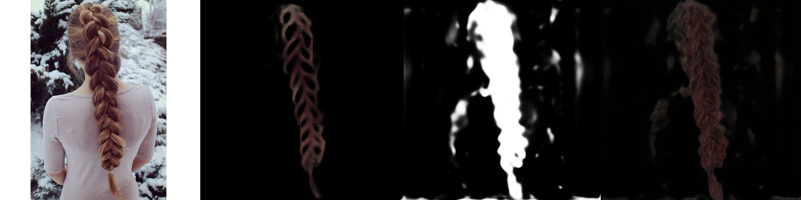
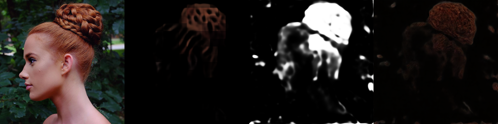
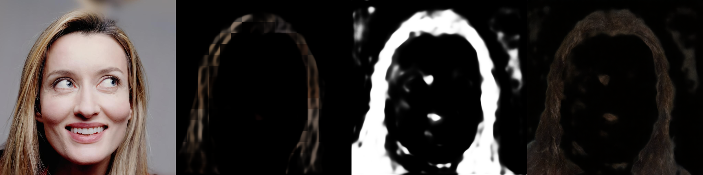
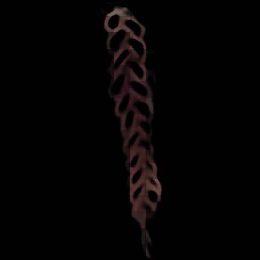
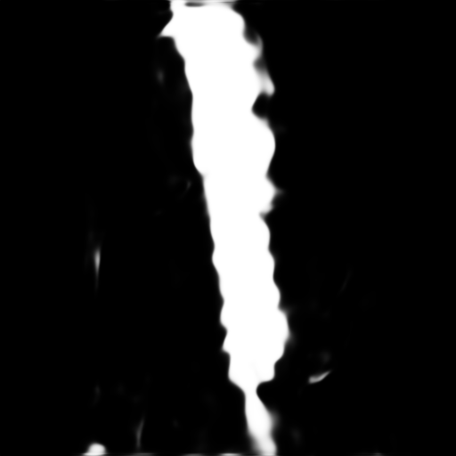
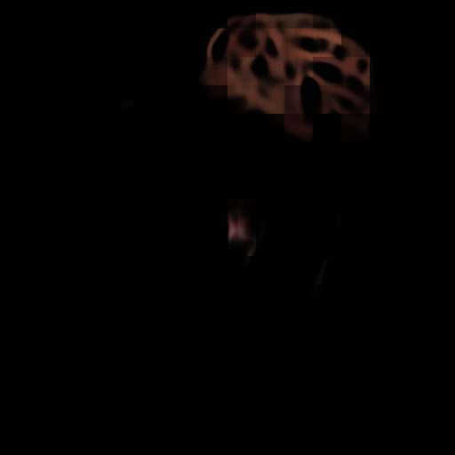
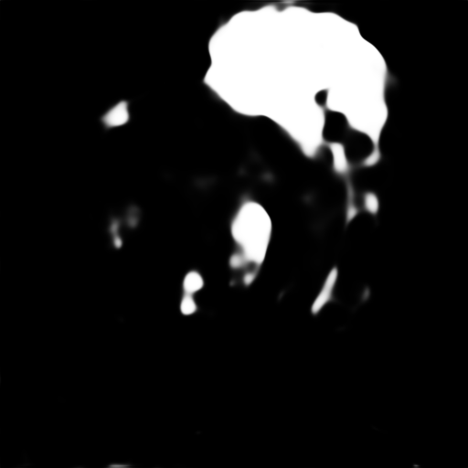

# Inverse 모델 실험 정리 (0509)

## 완료된 실험

### 실험 1. Frozen DiT + FPN Decoder

- Hair image를 VAE로 encode한 latent를 SD3.5 DiT에 통과시켜 24개 block의 intermediate feature 추출
- 추출된 feature를 FPN(Feature Pyramid Network) decoder에 입력하여 stroke mask와 matte 직접 예측
- Stroke mask에서 hair color를 patch sampling하여 colored sketch 생성
- **결과 불량** — SD3.5 DiT는 이미지 생성(denoising)을 위해 학습된 모델로, frozen 상태의 feature가 hair 구조의 선화(sketch) 정보를 충분히 인코딩하지 못함

**예측 결과 (inverse_head/last):**
- Sketch: 전반적으로 매우 어둡고 흐림. 색은 hair color에서 sampling되나 stroke 경계가 불분명하고, color patch 단위의 블록 아티팩트 발생. Braid 구조가 희미하게 보이는 수준
- Matte: 심각한 노이즈. 영역 전반에 걸쳐 불규칙한 흰색 패턴이 퍼져 있으며 경계가 완전히 불명확. Hair 영역과 배경 구분 실패

| | Sketch | Matte |
|---|---|---|
| braid_2534 |  |  |
| braid_2537 |  |  |

**Roundtrip 결과 (원본 → sketch → matte → forward model → 생성):**

> 패널 순서: `원본 hair` | `예측 sketch` | `예측 matte` | `roundtrip 생성 결과`

### 실험 2. Partial Unfreeze + Cycle Loss (Sequential)

- 실험 1의 구조를 유지하되, DiT back 12 blocks(12~23)를 unfreeze하여 hair→sketch task에 적응 가능하도록 변경 (front 12는 LoRA만 적용)
- Forward model을 frozen 상태로 유지하면서 cycle loss 추가: 예측한 sketch를 forward model에 입력했을 때 원본 hair가 복원되는지를 LPIPS로 측정하여 역전파
- Sequential 방식 — forward 학습 완료 후 동일 backbone 위에 inverse task를 순차적으로 학습
- **결과 불량** — Backbone 적응과 cycle loss를 추가했음에도 sketch/matte 품질이 유의미하게 개선되지 않음. 
**예측 결과 (comparison/last):**
- Sketch: 실험 1 대비 braid 구조의 stroke 윤곽이 소폭 선명해짐. 그러나 여전히 어둡고 흐리며 forward model에 입력하기에 부적합한 수준
- Matte: 경계가 다소 개선되었으나 CM(non-braid) 샘플에서 hair/배경/얼굴 영역 혼동이 심각하게 발생. 얼굴 영역을 hair로 인식하거나 전체적인 segmentation 실패 사례 다수 확인

| | Sketch | Matte |
|---|---|---|
| braid_2534 |  |  |
| braid_2537 |  |  |

**Roundtrip 결과 (원본 → sketch → matte → forward model → 생성):**

> 패널 순서: `예측 sketch` | `예측 matte` | `roundtrip 생성 결과` | `원본 hair`

## 분석

두 실험에서 matte 예측과 sketch 예측 모두 품질이 불량하며, 각각 독립적인 한계를 가짐.

Sketch 예측의 한계
- DiT intermediate feature는 이미지 생성(denoising) task에 최적화되어 있어 stroke 경계 등 선화 구조 정보를 충분히 인코딩하지 못함
- Stroke mask에서 color를 patch sampling하는 방식의 특성상 16×16 grid 단위 블록 아티팩트 발생 — forward model에 입력하기 부적합한 형태
- 전반적으로 어둡고 흐리며 stroke 경계가 불분명하여 forward model이 구조를 인식하기 어려운 수준

Matte 예측의 한계:
두 실험 공통적으로 matte 예측 품질이 결정적 병목으로 작용함. Sketch 품질과 무관하게, matte가 hair 영역을 정확히 분리하지 못하면 forward model 입력 자체가 불가능하므로 roundtrip 성능이 근본적으로 제한됨.

시도한 접근:
- Matte loss 가중치를 높여 재학습 → 개선 미미. Loss 가중치 조정만으로는 해결되지 않음을 확인

**고려 가능한 대안:**

1. Matte 예측 제외, 추론 시 GT matte 사용
   - Sketch 예측에만 집중하고 matte는 GT를 그대로 활용
   - 단점: 예측된 sketch의 유효 영역이 matte_GT 경계와 불일치할 경우 boundary 처리에서 부작용 발생 가능

2. SketchHairSalon의 matte 예측 모듈 활용
   - 기존 공개된 hair segmentation 모델을 matte 예측에 차용
   - 현재 데이터/학습 환경을 고려했을 때 가장 현실적인 단기 해결책으로 판단

3. Forward 모델 tuning 또는 재학습 고려
   - 현재 구조에서 forward model은 완전히 frozen된 감독관 역할만 수행
   - 그러나 inverse model이 생성하는 sketch가 GT sketch와 분포가 다를 경우, frozen forward model은 이를 제대로 처리하지 못함
   - Forward model을 inverse model의 출력 분포에 맞게 함께 tuning하거나, 처음부터 두 모델을 joint하게 학습하면 상호 적응이 가능
   - 단, forward model을 함께 학습할 경우 기존 forward 성능이 저하될 위험이 있으므로, forward 성능 regression 모니터링이 필수적

## 다음 실험 계획

### Sequential vs Bidirectional 비교 실험

Forward-Inverse joint training 방식의 유효성을 검증하기 위한 ablation 실험.

**Sequential (baseline):**
- Forward 학습 완료 후 동일 backbone 위에 inverse task를 순차적으로 학습
- Backbone이 forward에 먼저 적응된 상태에서 inverse 학습 시 backbone이 변형되면 forward 성능 회귀 위험
- 실질적으로는 "forward 모델 위에 inverse head를 얹는 것"에 가까워 bidirectional 주장이 약함

**Bidirectional / Mini-batch Alternating (제안):**
- 매 step마다 forward task와 inverse task를 교대로 학습
- Backbone이 두 task에 동시 적응 → forward 성능 회귀 없이 양방향 학습 가능
- Shared backbone으로 양방향 joint training이라는 paper claim의 실체

**실험 계획:**
1. Sequential — **완료 (실험 2)**, 결과 불량
2. Bidirectional alternating 방식으로 동일 조건 학습 및 결과 측정 예정
3. 두 결과 비교 — Bidirectional이 우세할 경우 강한 paper claim 성립
