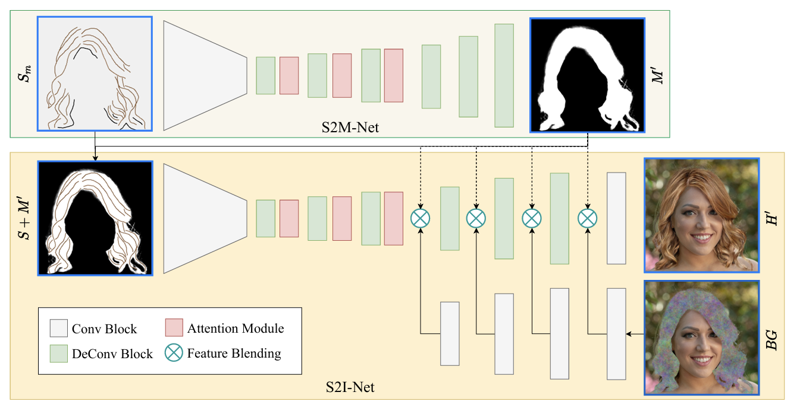
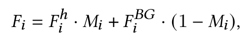

# S2I-Net: Hair 생성 원리

## 핵심 아이디어: Feature-level Blending

S2I-Net이 헤어스타일을 합성할 때 단순히 두 이미지를 픽셀 단위로 붙이는 것이 아니라,
디코더 내부의 특징(Feature) 수준에서 수학적으로 결합하는 방식을 사용한다.
이를 Background Blending Module이라 부른다.

---

## 전체 아키텍처 다이어그램

> **그림 설명**
>
> - **(상단) S2M-Net**: 스케치(S_c)를 입력받아 헤어 매트(M)를 예측하는 네트워크.
> - **(하단) S2I-Net**: 스케치와 예측된 매트를 함께 입력받아 최종 헤어 이미지를 합성하는 네트워크.
>   - 인코더(왼쪽)에서 스케치의 고차원 특징 `F_h^i`를 추출.
>   - 별도 **배경 인코더(BG 브랜치)** 에서 배경 특징 `F_BG^i`를 추출.
>   - 디코더(오른쪽) **마지막 4개 레이어** 에서 Feature Blending 수행.
>   - 최종 출력: 머리카락만 담은 이미지 `H`와 배경이 자연스럽게 합성된 최종 이미지 `BG`.

---

## 단계별 작동 원리

### 1. 배경 데이터의 분리/변환 (배경 인코더)

- 머리가 지워진(가우시안 노이즈 처리된) 원본 배경 이미지는 **메인 네트워크에 처음부터 함께 투입되지 않는다.**
  - 이유: 스케치 → 머리카락 생성이라는 작업에 방해가 되지 않도록 학습 능력을 온전히 집중시키기 위해 분리.
- 배경 이미지는 별도의 **Background Encoder** 를 통과하여
  고차원 숫자 배열인 **배경 특징 F_BG^i** 로 압축·변환된다.

### 2. 디코더 마지막 4개 레이어에서의 결합

- 메인 브랜치(디코더)는 사용자의 스케치를 바탕으로 **머리카락 특징 F_h^i** 를 생성한다.
- 디코더가 해상도를 키워가며 최종 이미지를 완성해 나가는 과정에서,
  **마지막 4개 레이어** 에 도달했을 때 배경 특징 F_BG^i 가 디코더 내부로 주입되어 머리카락 특징과 만난다.

### 3. 수식을 통한 Feature-level 혼합

두 특징이 디코더 내부에서 만나면 다음 수식으로 결합된다.

- `F_h^i` : 스케치로부터 생성된 머리카락 특징
- `F_BG^i` : 배경 인코더에서 추출한 배경 특징
- `M_i` : 해당 레이어 해상도로 다운샘플된 헤어 매트 (0~1 사이의 마스크)

| 매트 값 `M_i` | 의미 | 결과 |
|---|---|---|
| **1** (머리카락 영역) | F_h × 1 + F_BG × 0 | 머리카락 특징만 전달 |
| **0** (완전한 배경) | F_h × 0 + F_BG × 1 | 배경 특징만 유지 |
| **0.5** (경계/잔머리) | F_h × 0.5 + F_BG × 0.5 | 두 정보가 수치적으로 혼합된 새로운 통합 특징값 생성 |

---

## F_h^i 의 실제 형태 (코드 기준, 256×256 입력)

블렌딩이 일어나는 마지막 4개 레이어에서 F_h^i (`d5`~`d_8`)의 실제 텐서 shape:

| 레이어 | 변수명 | Shape (B, C, H, W) | 채널 수 | 공간 해상도 |
|---|---|---|---|---|
| 디코더 5번째 | `d5` | (B, **512**, 32, 32) | 512ch | 1/8 |
| 디코더 6번째 | `d6` | (B, **256**, 64, 64) | 256ch | 1/4 |
| 디코더 7번째 | `d7` | (B, **128**, 128, 128) | 128ch | 1/2 |
| 디코더 8번째 | `d_8` | (B, **64**, 256, 256) | 64ch | 원본 |

> `d5 = deconv5(d4)` + skip-connection `e3` 을 concat한 결과이므로,
> 실제로는 "메인 디코더 경로 + 인코더 skip 정보"가 합쳐진 텐서다.

배경 인코더(`BgEncoder`)도 같은 해상도로 매칭되도록 설계되어 있다:

| BG 특징 | Shape | 매칭 레이어 |
|---|---|---|
| `x3` | (B, 512, 32, 32) | `d5` |
| `x2` | (B, 256, 64, 64) | `d6` |
| `x1` | (B, 128, 128, 128) | `d7` |
| `x0` | (B, 64, 256, 256) | `d_8` |

블렌딩 후 `conv_final` (3×3 conv) → `tanh` 를 거쳐 최종 출력이 **(B, 3, 256, 256), 값 범위 [-1, 1]** 의 RGB 이미지로 나온다.
`infer_hairsalon_custom.py` 에서 `(out + 1) / 2 × 255` 로 변환해 저장하는 이유가 이 때문이다.

