모델 소개

[학습방법](https://github.com/agliotomato/Sketch-DiT-ControlNet/blob/main/architecture.md)

# Phase 2: Braid Fine-tuning 결과

## 학습 설정

| 항목 | 값 |
|---|---|
| 백본 | SD3.5 Medium (8B) + HairControlNet (12 layers) |
| Phase 1 체크포인트 | `checkpoints/phase1_unbraid/epoch_40.pth` |
| 데이터셋 | braid_train (1,000샘플) |
| Epochs | 100 |
| Batch size | 8 |
| Learning rate | 2e-5 |
| Loss | Flow matching + LPIPS (즉시 활성화) + Edge alignment (w=0.05) |
| 최종 avg loss | 0.0105 |

---

## Inference 결과 (braid_test, 16샘플, 20 steps)


| 열 | 이름 | 설명 |
|---|---|---|
| 1열 | **Sketch** | 입력 컬러 스케치. 색은 strand 구분용(땋임 패턴, 선방향, 교차 구조 포함) |
| 2열 | **Matte** | 입력 soft alpha matte. 머리카락 영역(0~1). 모델이 생성 범위를 이 영역으로 제한 |
| 3열 | **Generated** | 모델 출력. sketch + matte를 조건으로 flow matching 20스텝 denoising하여 생성한 hair region |
| 4열 | **Target** | Ground Truth. 원본 사진에서 `img × matte`로 추출한 실제 머리카락 영역 |

---

## Inference 결과 이미지 (braid_test, 16샘플)

| Sketch | Matte | Generated | Target |
|--------|-------|-----------|--------|
|  |  |  |  |
|  |  |  |  |
|  |  |  |  |
|  |  |  |  |
|  |  |  |  |
|  |  |  |  |
|  |  |  |  |
|  |  |  |  |
|  |  |  |  |
|  |  |  |  |
|  |  |  |  |
|  |  |  |  |
|  |  |  |  |
|  |  |  |  |
|  |  |  |  |
|  |  |  |  |


## GAN 과의 비교


## 피드백
의도색이 반영되게 하기(비교 실험에서 꼭 필요한 것 중 하나)
추가로 같이 하면 좋을 것. 

헤어패치만으로 Original Hairsalon 의 결과와 비교
학습에 사용하지 않은 헤어 스케치 한 것 확인 및 비교
 


## 색 제어 구현 계획 (exp1-stroke-color)

### 문제 분석

현재(main 브랜치)는 `SketchColorJitter(p=0.8)`로 학습되었다.
이 augmentation은 매 iteration마다 stroke 색을 **완전 랜덤 HSV 색**으로 교체한다.

```
갈색 머리 target → stroke 색이 초록, 파랑, 노랑 등 무관한 색으로 바뀜
```

모델 입장에서 stroke 색과 target 색 사이에 아무 패턴이 없으므로, 모델이 색을 무시하도록 학습된다.
결과적으로 구조(선 방향, 교차, 땋임 패턴)만 보고 머리를 생성하며, 색은 학습 데이터 평균으로 수렴한다.

### 참고: SketchHairSalon(GAN) 방식

GAN은 `color_coding()` 함수로 학습 시 stroke 색을 교체한다.

```
각 stroke 영역 → target 이미지의 해당 위치 픽셀 평균/샘플링
→ 그 색을 stroke 색으로 할당 (매 iteration마다 새로 샘플링)
```

이를 통해 모델이 "stroke 색 = 해당 위치 실제 머리 색"을 학습하게 된다.
GAN baseline 실험에서 `color_coding` 적용 시 출력 머리 색이 stroke 색을 따르는 것을 확인하였다.

### 비교 결과


| Colored Sketch | input이 color sketch인 결과 | stroke 색 교체 후 Sketch | stroke 색 교체 결과 | DiT Generated(stroke 무작위) |
|---|---|---|---|---|
|  |  | 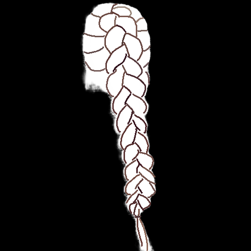 | 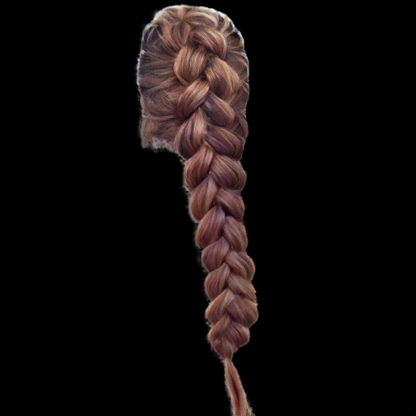 |  |
|  | 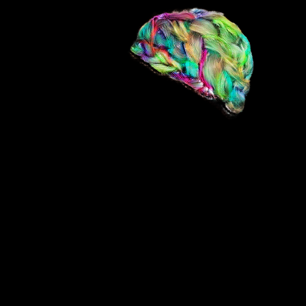 | 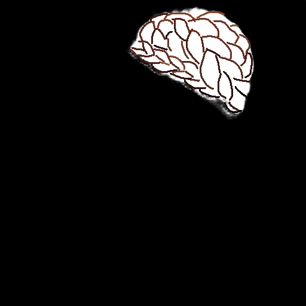 | 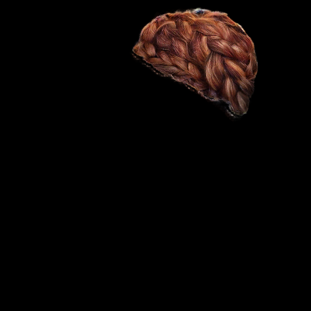 |  |
|  | 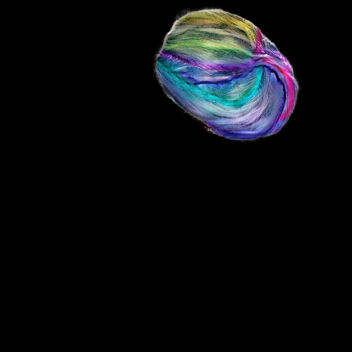 | 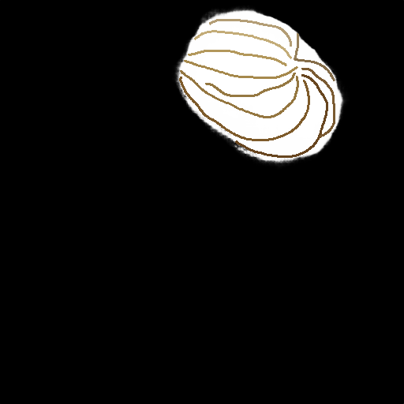 | 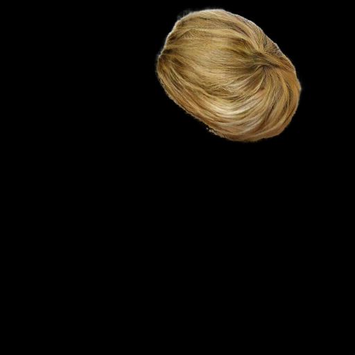 |  |
|  | 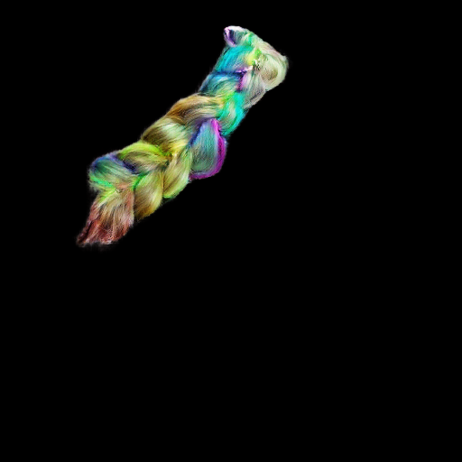 | 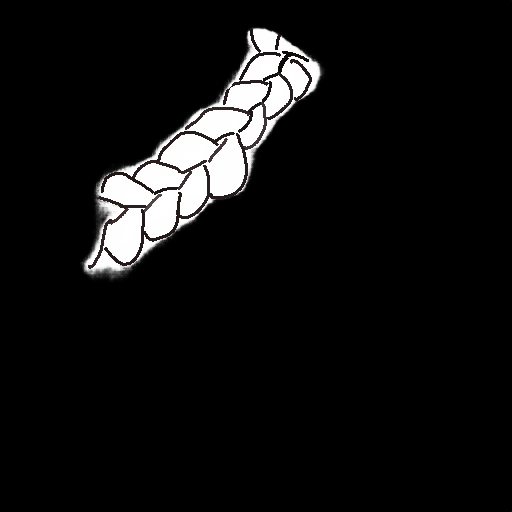 | 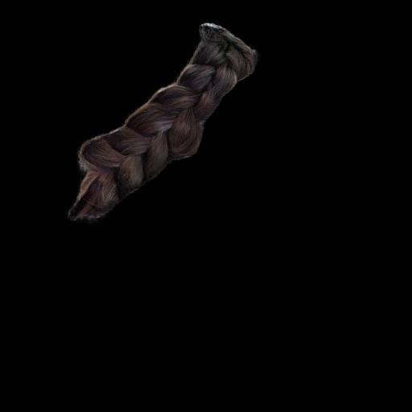 |  |
|  | 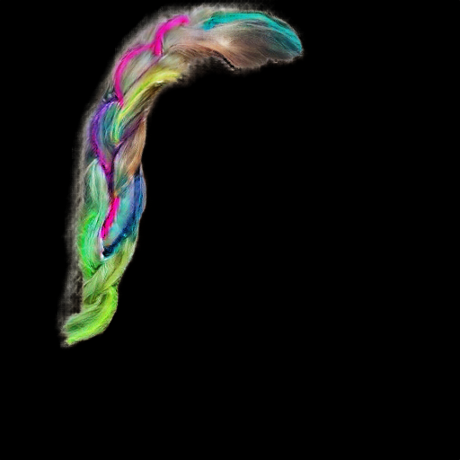 | 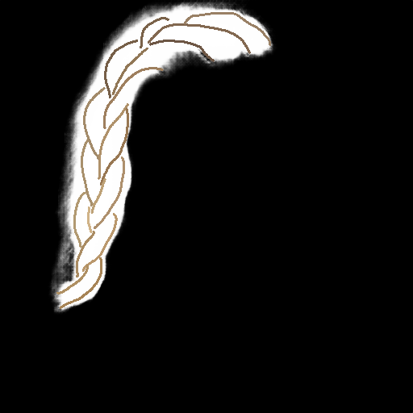 | 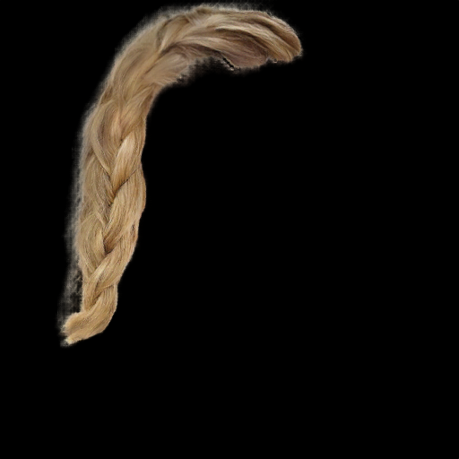 |  |


### 변경 방식: StrokeColorSampler

GAN의 `color_coding`과 동일한 원리를 DiT 학습에 적용한다.

```python
# 각 stroke 영역 → target 이미지의 해당 위치 픽셀 중 무작위 1개 샘플링
# → 그 색을 stroke 색으로 할당 (매 iteration마다 새로 샘플링)
```

GAN과의 차이점:
- GAN(`color_coding`): RGB 스케치를 grayscale로 변환한 뒤 밝기 값으로 stroke 구분
  - `color_coding` 함수가 grayscale 입력을 요구하도록 구현되어 있어 변환 후 전달
  - 서로 다른 색의 stroke라도 밝기가 비슷하면 같은 stroke로 합쳐지는 collision 위험
- 우리(`StrokeColorSampler`): RGB 값 그대로 양자화하여 stroke 구분
  - stroke마다 임의 레이블 색(보라, 파랑, 초록 등)이 부여되어 있어 RGB로 구분하면 collision 없이 정확하게 식별 가능

`AppearanceJitter`도 함께 제거한다. target 색을 흔들면 stroke ↔ target 색 대응이 깨지기 때문이다.

### 기대 효과

```
갈색 stroke → 갈색 머리  ✓ 
금발 stroke → 금발 머리  ✓
검정 stroke → 검정 머리  ✓
```

### 한계

학습 데이터에 존재하지 않는 색(보라, 파란색 등 비자연 색상)은 제어 불가.
색 제어 품질은 데이터셋 내 머리 색 분포에 직접적으로 의존한다.


